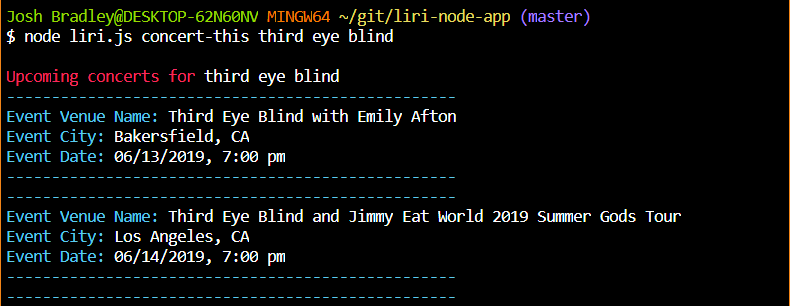

# liri-node-app
LIRI is a language interpretation and recognition interface application that runs on the command line.  It takes in one of four commands, along with a search query, and returns information based on the combination of the two parameters.


## Command Line Input
The command line requires a specific structure in order to execute properly
```
node liri.js command search
```
where 'command' is one of the four options listed below and 'search' is your search input.

If an incorrect command is entered, the terminal will display the available options.


## Instructions
### Available commands:
**concert-this**   Find upcoming concert information including venue name, locations, date, and time utilizing the Bands In Town API

**spotify-this-song**   Find song information including artist name, track name, song preview, and album name utlizing the Spotify API

**movie-this**   Find movie information including title, release year, IMDb rating, Rotten Tomatoes rating, country, available languages, plot, and cast members utilizing the OMDb API

**do-what-it-says**   Returns data based on command and search query listed in random.txt (Does not accept a search parameter)

### Search query:
The application will take in any search parameter from the command line, but for the best results, try to be as specific as possible.  For example, using "movie-this" with a search string of "return of the king" will not return data related to the final installment of the Lord of the Rings trilogy, but "lord of the rings return of the king" will.

A blank search field will return a default option for each of the commands.

## Resources
The application was created with **Node.js** utilizing the following package installs:

**Dotenv**
```
npm i dotenv
```
Storing and securing API keys

**Chalk**
```
npm i chalk
```
Decorating command line

**Axios**
```
npm i axios
```
Making API requests for Bands in Town and OMDb

**Moment**
```
npm i moment
```
Formatting concert date/time

**Spotify API**
```
npm i node-spotify-api
```
Making API request for Spotify

## Demo
Screenshots demonstrating functionality

**Unrecognized Command Input**


**concert-this with search parameter**


**concert-this without input**


**spotify-this-song with search parameter**


**spotify-this-song without input**


**movie-this with search parameter**


**movie-this without input**


**do-what-it-says**

